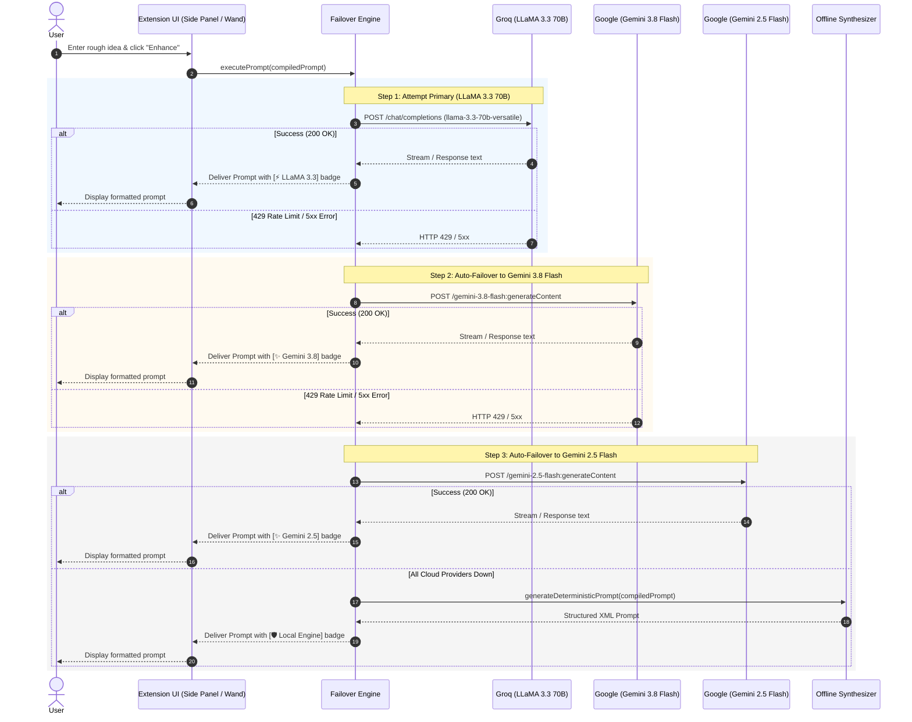

# Technical Specification: LLaMA 3.3 70B Primary + Multi-Model Failover Engine

## 1. Executive Summary
PromptForge AI (`prompt-generator`) is transitioning from a manual Bring-Your-Own-Key (BYOK) setup to an automated, self-healing **Multi-Model Failover Engine**. The system defaults to **LLaMA 3.3 70B** as its primary generator for ultra-fast, unrestricted, and high-intelligence coding prompt generation. If the primary provider encounters rate limits (HTTP 429) or transient server errors (HTTP 5xx), the engine automatically and imperceptibly cascades down a failover chain to **Gemini 3.8 Flash**, **Gemini 2.5 Flash**, and an offline fallback synthesizer.

---

## 2. Architecture & Failover Chain

### 2.1 Model Hierarchy
1. **Primary Model — LLaMA 3.3 70B (`llama-3.3-70b-versatile`)**:
   - Provider: Groq Cloud (Free Tier)
   - API Format: OpenAI-compatible REST API (`https://api.groq.com/openai/v1/chat/completions`)
   - Generation Speed: 300+ tokens/sec
   - Characteristics: Open weights, zero corporate censorship on system architecture/security prompts, state-of-the-art coding abilities.

2. **First Failover — Gemini 3.8 Flash (`gemini-3.8-flash`)**:
   - Provider: Google AI Studio (Free Tier)
   - API Format: Google Generative Language REST API (`https://generativelanguage.googleapis.com/v1beta/models/gemini-3.8-flash:generateContent`)
   - Characteristics: Google's flagship model engineered for long-horizon software engineering, autonomous agents, and multi-step coding specifications.

3. **Second Failover — Gemini 2.5 Flash (`gemini-2.5-flash`)**:
   - Provider: Google AI Studio (Free Tier)
   - Characteristics: High-volume, reliable fallback if Gemini 3.8 is temporarily congested.

4. **Third Failover (Offline Safeguard) — Smart Local Synthesizer**:
   - Provider: Internal TypeScript Rule Engine
   - Characteristics: Operates client-side with 0ms latency, requiring zero network calls if the user is offline or all cloud providers fail.

### 2.2 Failover Sequence Diagram

---

## 3. Component Design & Changes

### 3.1 Domain Types (`src/types/index.ts`)
- Update `ProviderType` to include `'groq'` alongside `'gemini'`, `'openai'`, `'anthropic'`, and `'auto'`.
- Add `modelGroq: string` (default: `'llama-3.3-70b-versatile'`) and `apiKeyGroq?: string` to `AppSettings`.
- Add `activeModelUsed?: string` to `PromptHistoryItem` to track which model fulfilled the request.

### 3.2 Groq Client (`src/services/ai/groq.ts`)
- Implements `AIClient` interface.
- Constructs requests targeting `https://api.groq.com/openai/v1/chat/completions`.
- Handles streaming SSE chunks (`data: {"choices":[{"delta":{"content":"..."}}]}`).
- Throws distinct `RateLimitError` or `ServiceUnavailableError` when status is 429, 500, or 503 so the router triggers immediate failover.

### 3.3 Gemini Client Updates (`src/services/ai/gemini.ts`)
- Fully supports `gemini-3.8-flash` as a top-level model identifier alongside `gemini-2.5-flash`.
- Translates 429 and 503 errors into catchable failover exceptions.

### 3.4 Multi-Model Failover Router (`src/services/ai/failover-router.ts`)
- Implements a resilient pipeline executing candidates in priority order:
  1. `GroqClient` (LLaMA 3.3 70B)
  2. `GeminiClient` (Gemini 3.8 Flash)
  3. `GeminiClient` (Gemini 2.5 Flash)
  4. `LocalSynthesizer`
- Notifies the caller of status transitions via optional callback: `onModelSwitch?: (modelName: string) => void`.

### 3.5 Extension UI (`src/sidepanel/`)
- **Studio Tab**:
  - Removes the "missing API key" warning banner.
  - Adds a dynamic indicator showing which model is currently generating or generated the prompt (e.g. `⚡ LLaMA 3.3 70B`).
- **Settings Tab**:
  - Reorganized to highlight the **Automatic Multi-Model Engine (LLaMA 3.3 + Gemini 3.8)**.
  - Keeps optional override fields for users who wish to supply their personal Groq or Google AI Studio keys.

---

## 4. Verification & Testing Strategy

1. **Unit Testing (`tests/groq-client.test.ts`)**:
   - Verify request structure, headers (`Authorization: Bearer <key>`), and payload.
   - Test streaming SSE response decoding.
   - Verify rate-limit error classification on HTTP 429.

2. **Router Testing (`tests/failover-router.test.ts`)**:
   - Test happy path: Groq succeeds, returns LLaMA output.
   - Test failover 1: Groq returns 429, router immediately succeeds with Gemini 3.8.
   - Test failover 2: Groq & Gemini 3.8 return 429, router succeeds with Gemini 2.5.
   - Test offline safeguard: All cloud fetches fail, router generates structured output using local synthesizer.

3. **Full Build & Bundle Verification**:
   - Run `npm test` across all test files.
   - Run `tsc --noEmit && vite build` to ensure `dist/` is valid and packaged for Chrome.
